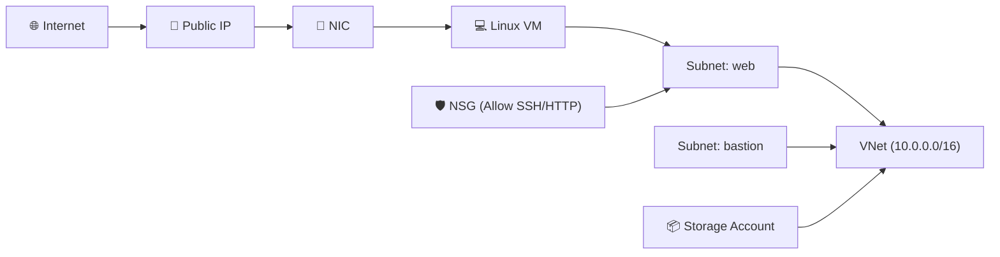

# 🚀 Azure VM Landing Environment（個人ポートフォリオ）

Azure の基礎リソース（VNet / Subnet / NSG / Public IP / Linux VM）を  
**Bicep による IaC（Infrastructure as Code）で自動構築**した個人ポートフォリオです。

---

# 📦 構成概要

- Resource Group  
- Virtual Network（10.0.0.0/16）
  - Subnet-web（10.0.1.0/24）
  - Subnet-bastion（10.0.2.0/24）
- Network Security Group（Allow-SSH / Allow-HTTP）
- Public IP  
- NIC  
- Linux VM（Ubuntu 20.04 / B2s）  
- Storage Account  

---



### 🌐 VNet / Subnet

10.0.0.0/16 のアドレス空間を持つ VNet を作成し、
Web（10.0.1.0/24）および Bastion（10.0.2.0/24）を分離しています。


### 🛡️ Network Security Group（NSG）

Allow-SSH(22) / Allow-HTTP(80) のみ許可し、最小限かつシンプルな初期構成 で公開しています。


### 💻 Virtual Machine（VM）

B2s（2vCPU / 4GB）サイズの Ubuntu 20.04 LTS をデプロイ。
Public IP 経由で SSH / HTTP が動作確認済み。


## 🌐 Public IP の確認
この VM に割り当てられた Public IP は以下です。


---

🔌 HTTP 通信確認（curl）
ローカル PC または VM 内部から curl で HTTP 応答を確認しました。

```bash
curl http://<Public-IP>
```


nginx のデフォルトページが返り、HTTP 通信が成功していることを確認できます。

